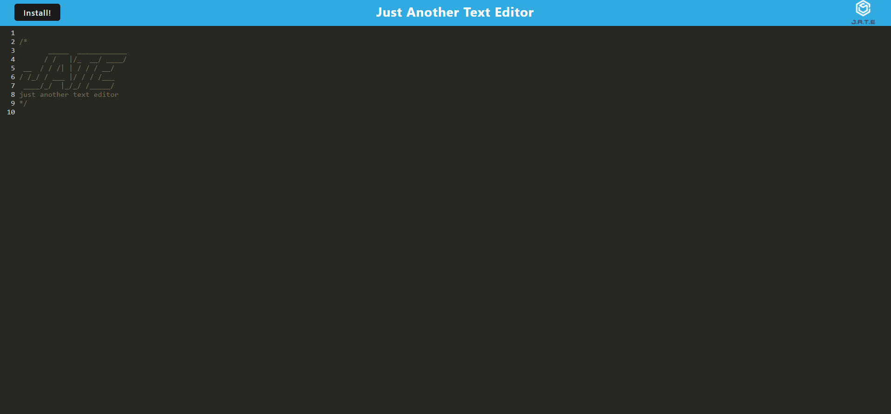

# text-editor

PWA - Progressive Web Application  

A text editor that allows you to create notes and code snippets without an internet connection using IndexedDB  

Installation instructions:  

Dependencies: 
express 
if-env 
express 
code-mirror-themes 
idb  

From Bash: npm install, npm run build, npm start

My Github:https://github.com/tarajevans
Github Repo: https://github.com/tarajevans/text-editor
Deployed page: https://jate-tje.herokuapp.com/

